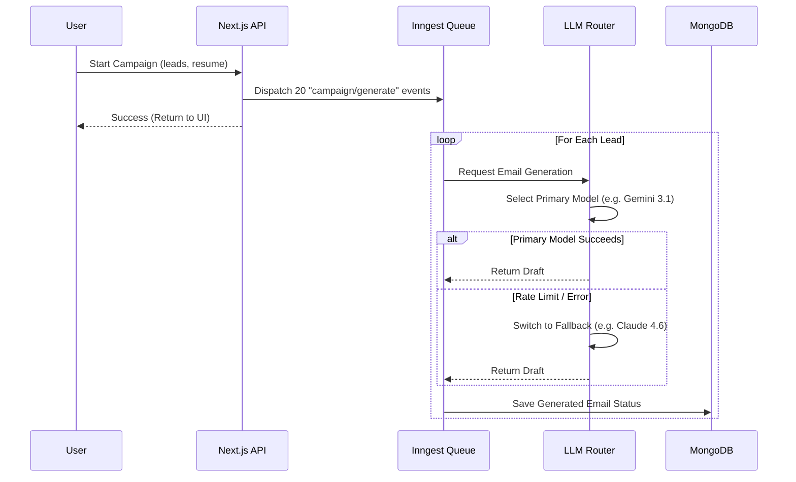
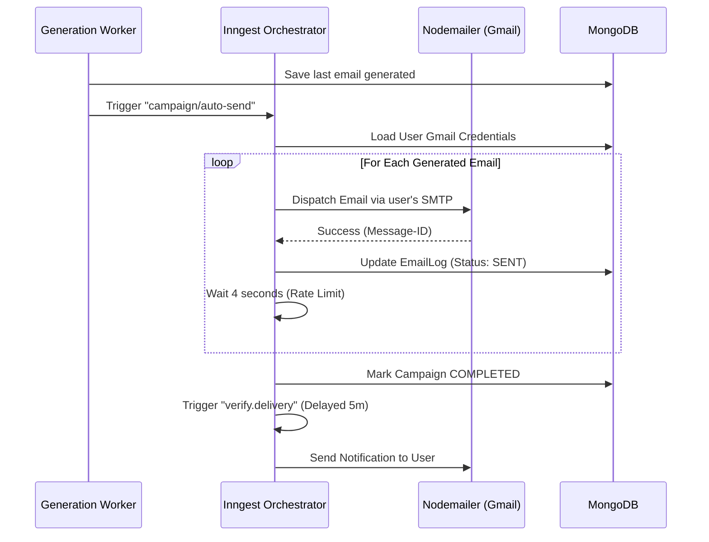
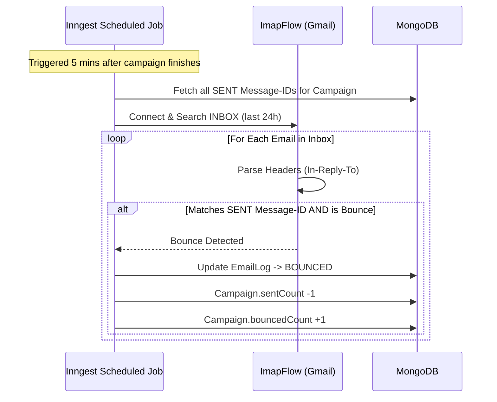
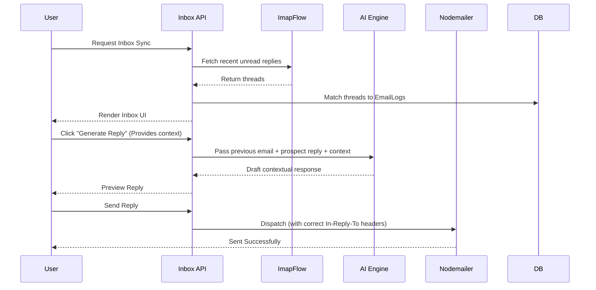

<div align="center">
  <h1>🚀 Pitchr</h1>
  <p><strong>The Intelligent B2B Cold Email Automation Platform</strong></p>
  <p>A production-ready platform designed to scale outbound recruitment and sales workflows. Pitchr combines Multi-LLM routing, asynchronous job queues, and direct IMAP/SMTP integrations to craft, dispatch, and track highly personalized outreach campaigns.</p>
</div>

---

## ✨ Core Feature

* 🧠 **AI-Powered Personalization**: Generates highly targeted email copy by analyzing candidate resumes against target job descriptions or company profiles.
* 🔀 **Smart LLM Routing & Failover**: Intelligently routes generation tasks between Gemini, Claude, OpenAI, and DeepSeek. Automatically handles rate limits and quota exhaustion with zero-downtime failover.
* ⚡ **Background Processing**: Heavy lifting (AI generation, batch sending, delivery verification) is handled asynchronously via Inngest, allowing users to close their browsers while campaigns run.
* 📬 **Direct Gmail Integration**: Connects directly to user Gmail accounts via App Passwords. Outbound emails are sent natively via SMTP, and replies are parsed directly via IMAP.
* 🛡️ **Duplicate Detection**: Cross-references uploaded lead lists against historical campaign data to prevent embarrassing duplicate outreach.
* 📊 **Automated Delivery Verification**: Runs 5-minute post-send IMAP verification jobs to accurately detect hard bounces and delivery failures, ensuring campaign statistics reflect reality.
* 🤖 **Smart Inbox & Auto-Replies**: Pulls replies into a unified dashboard and offers one-click AI-drafted responses tailored to the thread context.

---

## 🏗️ Architecture & Workflows

Pitchr is built on a modern, scalable architecture designed for high throughput and reliability.

### 1. Smart LLM Generation & Failover Workflow

Pitchr's AI Engine is designed to never fail a generation. If an AI provider throws a rate-limit error (429) or is exhausted, the system automatically falls back to the next available model.



### 2. Auto-Send & Dispatch Workflow

When "Auto Send" is enabled, Pitchr orchestrates the entire send sequence in the background, strictly adhering to SMTP rate limits to protect sender reputation.



### 3. Automated Bounce Detection Workflow

To ensure accuracy in open and success rates, Pitchr actively monitors the user's inbox post-send to catch Delivery Status Notifications (DSNs) and "Mailer-Daemon" bounce replies.



### 4. Smart Inbox & Reply Workflow

Users can manage replies directly from Pitchr, leveraging AI context to draft instant responses.



---

## 🚀 Getting Started

### Prerequisites
- **Node.js**: v18 or newer
- **MongoDB**: Local instance or MongoDB Atlas
- **Gmail Account**: Must have 2-Step Verification enabled to generate App Passwords
- **API Keys**: At least one active API key (OpenAI, Anthropic, Gemini, or DeepSeek)

### 1. Clone the Repository
```bash
git clone https://github.com/your-org/pitchr.git
cd pitchr
```

### 2. Install Dependencies
```bash
npm install
```

### 3. Environment Configuration
Create a `.env.local` file in the root directory. Use `.env.example` as a template:

```env
# Database
MONGODB_URI=mongodb+srv://<user>:<password>@cluster.mongodb.net/pitchr

# Authentication (NextAuth)
NEXTAUTH_SECRET=your_secure_random_string_min_32_chars
NEXTAUTH_URL=http://localhost:3000

# Security (AES-256)
# MUST BE EXACTLY 32 CHARACTERS
ENCRYPTION_KEY=12345678901234567890123456789012

# System Notifications Mailer
GMAIL_USER=your_system_email@gmail.com
GMAIL_USER_PASSWORD=your_system_app_password

# Background Jobs (Local Dev)
INNGEST_EVENT_KEY=local
INNGEST_SIGNING_KEY=local
```

### 4. Run the Development Environment
Pitchr requires two processes running simultaneously in development:

**Terminal 1: Start Next.js Server**
```bash
npm run dev
```

**Terminal 2: Start Inngest Dev Server**
```bash
npx inngest-cli@latest dev
```

Open [http://localhost:3000](http://localhost:3000) to view the application. The Inngest dashboard runs on `http://localhost:8288`.

---

## 📖 Documentation

The `docs/` directory contains highly detailed technical specifications for the entire platform:

- [API Reference (`docs/api.md`)](./docs/api.md) — Comprehensive documentation of every REST API route, request/response payload, HTTP status codes, and background event triggers.

---

## 🔒 Security & Best Practices

- **Encryption at Rest**: User-provided API keys and Gmail App Passwords are AES-256 encrypted in MongoDB before being stored. Decryption happens dynamically only in secure server environments.
- **Rate Limiting**: To prevent Google Workspace throttling (Error 421) and spam-flagging, the batch dispatcher imposes a hard 4-second delay between every outbound SMTP request.
- **Fail-safes**: The system uses Atomic MongoDB operations (`$inc`) when updating Campaign metrics from background workers to prevent race conditions.
- **Admin Configuration**: Master LLM API keys can be set at the environment level and are restricted via an Admin Dashboard.

---

## 🛠️ Deployment Instructions

Pitchr is optimized for deployment on Vercel:

1. Push your code to a Git repository (GitHub/GitLab).
2. Import the project into Vercel.
3. Configure all environment variables in the Vercel dashboard.
4. Set up an [Inngest Cloud](https://app.inngest.com/) account.
5. In Inngest, sync your application URL (e.g., `https://pitchr.yourdomain.com/api/inngest`).
6. Add the Inngest production `INNGEST_EVENT_KEY` and `INNGEST_SIGNING_KEY` to Vercel.
7. Deploy.

---
*Pitchr - Automating outreach without losing the human touch.*
