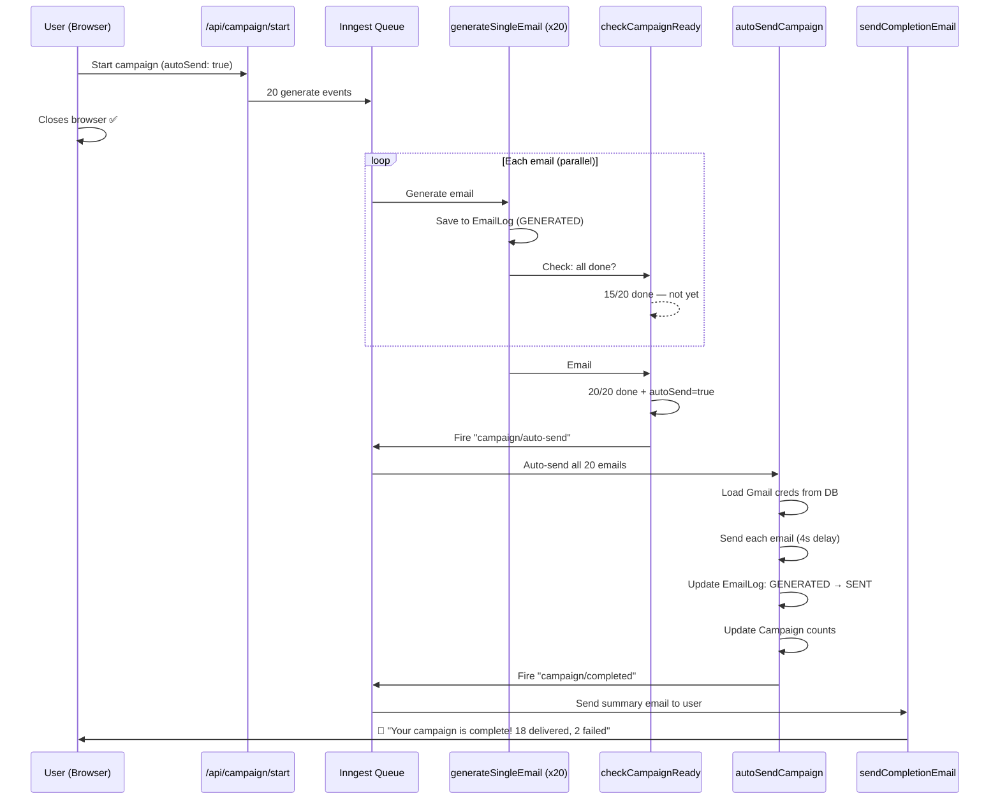

# Plan: Auto Send + Campaign Completion Notification

## Feature 1: Auto Send Toggle

### Current Flow (Manual)
```
User uploads leads → Generates emails → Reviews/edits on UI → Clicks "Send" → SSE stream sends one by one
```
**Problem:** User must keep the browser open the entire time.

### New Flow (Auto Send ON)
```
User uploads leads → Toggles "Auto Send" ON → Clicks "Generate" → Closes browser → 
Background: emails generate one by one → 
Background: when ALL generated, auto-send starts →
Background: sends each email via user's Gmail →
Background: sends summary notification email to user
```

### How It Works



## Feature 2: Completion Notification Email

**Triggered after EVERY campaign finishes**, whether manual or auto:

```
Subject: ✅ Pitchr Campaign Complete — "Campaign May 9"
Body:
  Hi Varun,
  
  Your campaign "Campaign May 9" has finished!
  
  📊 Results:
  • Total leads: 20
  • Sent successfully: 18
  • Failed to send: 2
  
  View full details: https://pitchr.app/dashboard/history/{campaignId}
  
  — Pitchr
```

---

## Changes Required

### 1. Campaign Model — Add `autoSend` flag

**File:** `models/Campaign.ts`

```diff
  status: "DRAFT" | "GENERATING" | "READY" | "SENDING" | "COMPLETED" | "FAILED";
+ autoSend: boolean;
  totalLeads: number;
```

### 2. Campaign Start API — Accept `autoSend` param

**File:** `app/api/campaign/start/route.ts`

```diff
- const { campaignId, leads, resumeText } = await request.json();
+ const { campaignId, leads, resumeText, autoSend } = await request.json();

  campaign.status = "GENERATING";
  campaign.totalLeads = leads.length;
+ campaign.autoSend = autoSend || false;
```

### 3. After Each Email Generated — Check If Campaign Is Complete

**File:** `inngest/functions.ts` → `generateSingleEmail`

After saving the generated email, add a new step:

```typescript
await step.run("check-campaign-complete", async () => {
  await dbConnect();
  
  const campaign = await Campaign.findById(campaignId);
  if (!campaign) return;
  
  // Count how many are done (GENERATED or FAILED)
  const doneCount = await EmailLog.countDocuments({
    campaignId: new Types.ObjectId(campaignId),
    status: { $in: ["GENERATED", "FAILED", "SENT"] },
  });
  
  if (doneCount >= campaign.totalLeads) {
    if (campaign.autoSend) {
      // All generated + auto-send ON → trigger auto-send
      await Campaign.updateOne({ _id: campaignId }, { status: "SENDING" });
      await inngest.send({
        name: "campaign/auto-send",
        data: { campaignId, userId },
      });
    } else {
      // All generated + manual mode → mark READY
      await Campaign.updateOne({ _id: campaignId }, { status: "READY" });
    }
  }
});
```

### 4. New Inngest Function: `autoSendCampaign`

**File:** `inngest/functions.ts` (new export)

This is the background version of `send-batch/route.ts`. It:
1. Loads user's Gmail credentials from DB
2. Fetches all GENERATED emails for the campaign
3. Sends each one via Nodemailer (4s delay between sends)
4. Updates EmailLog status (GENERATED → SENT / FAILED)
5. Updates Campaign counts
6. Fires `campaign/verify.delivery` for bounce checking
7. Fires `campaign/completed` for notification

### 5. New Inngest Function: `sendCompletionEmail`

**File:** `inngest/functions.ts` (new export)

Triggered by `campaign/completed` event. Sends a summary email to the user using their own Gmail SMTP.

### 6. Update `send-batch/route.ts` — Fire completion event after manual send

**File:** `app/api/send-batch/route.ts`

After the SSE stream completes and campaign is marked COMPLETED:

```diff
  await Campaign.updateOne({ _id: campaign._id }, { status: "COMPLETED" });
+ 
+ // Fire completion notification
+ await inngest.send({
+   name: "campaign/completed",
+   data: { campaignId: campaign._id.toString(), userId: user._id.toString() },
+ });
```

### 7. UI — Auto Send Toggle

**File:** `app/dashboard/campaign/new/page.tsx`

Add a toggle switch in Step 2 (before the Generate button):

```
┌─────────────────────────────────────────┐
│  ⚡ Auto Send                    [OFF]  │
│  When enabled, emails will be sent      │
│  automatically after generation.        │
│  You can close the browser — we'll      │
│  email you when it's done.              │
└─────────────────────────────────────────┘
```

When ON:
- The "Generate & Review" button changes to **"Generate & Auto Send"**
- A warning shows: "Emails will be sent without review"
- The `autoSend` flag is passed to `/api/campaign/start`

### 8. Register New Functions

**File:** `app/api/inngest/route.ts`

```diff
- import { generateSingleEmail, verifyDelivery } from "@/inngest/functions";
+ import { generateSingleEmail, verifyDelivery, autoSendCampaign, sendCompletionEmail } from "@/inngest/functions";

  functions: [
    generateSingleEmail,
    verifyDelivery,
+   autoSendCampaign,
+   sendCompletionEmail,
  ],
```

---

## Summary of New Inngest Events

| Event | Triggered By | Handler |
|---|---|---|
| `campaign/auto-send` | `generateSingleEmail` (when all done + autoSend=true) | `autoSendCampaign` |
| `campaign/completed` | `autoSendCampaign` or `send-batch` (after manual send) | `sendCompletionEmail` |
| `campaign/verify.delivery` | `autoSendCampaign` or `send-batch` | `verifyDelivery` (existing) |

## Files Changed

| File | Type | Description |
|---|---|---|
| `models/Campaign.ts` | Edit | Add `autoSend: boolean` field |
| `app/api/campaign/start/route.ts` | Edit | Accept and store `autoSend` flag |
| `inngest/functions.ts` | Edit | Add completion check to `generateSingleEmail`, add `autoSendCampaign` + `sendCompletionEmail` functions |
| `app/api/inngest/route.ts` | Edit | Register 2 new functions |
| `app/api/send-batch/route.ts` | Edit | Fire `campaign/completed` event after manual send |
| `app/dashboard/campaign/new/page.tsx` | Edit | Add Auto Send toggle, update button text, pass flag to API |

> [!IMPORTANT]
> The auto-send uses the user's saved Gmail credentials from the database — same credentials used for manual send. No additional setup required from the user.

> [!TIP]
> The completion email is sent using the user's OWN Gmail (from themselves, to themselves). This way we don't need a separate transactional email service. The user sees it as a self-sent summary in their inbox.
