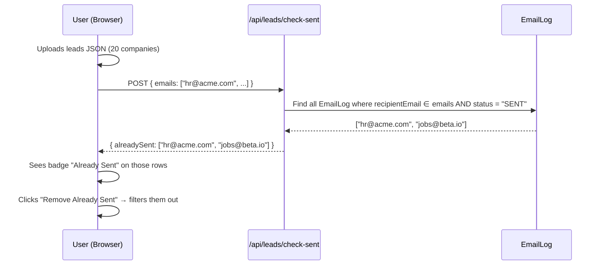
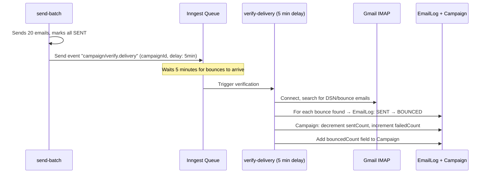

# Plan: Duplicate Lead Detection + Email Delivery Verification

## Problem 1: User Unknowingly Re-Sends to Same Company

### Current Behavior
User uploads leads JSON → sees a company table → generates emails → sends. There's **no check** if they already emailed `careers@acme.com` last week. They can accidentally spam the same company.

### What We Have
- `EmailLog` stores every sent email with `recipientEmail`, `companyName`, `status`, `userId`
- History page reads from `Campaign` model (sentCount, failedCount)

### Solution: Cross-Check on Upload



### Changes Required

| File | Change |
|---|---|
| **`app/api/leads/check-sent/route.ts`** (NEW) | Accepts `{ emails: string[] }`, returns which ones have `status: "SENT"` in EmailLog for this user |
| **`components/company-table.tsx`** | Add `alreadySent` prop. Show orange "Already Sent" badge on matching rows |
| **`app/dashboard/campaign/new/page.tsx`** | After leads upload, call `/api/leads/check-sent`. Pass `alreadySent` set to CompanyTable. Add "Remove Already Sent" button above the table |

### New API: `POST /api/leads/check-sent`

```typescript
// Input:  { emails: ["hr@acme.com", "jobs@beta.io", ...] }
// Output: { alreadySent: ["hr@acme.com"] }

// Query:
const sent = await EmailLog.find({
  userId: user._id,
  recipientEmail: { $in: emails },
  status: { $in: ["SENT", "BOUNCED"] },  // Include bounced too
}).distinct("recipientEmail");
```

### UI Changes

**CompanyTable** — new column/badge:
```
| Company     | Role           | Email          | Status        |
| Acme Corp   | Full Stack Dev | hr@acme.com    | ⚠ Already Sent |
| Beta IO     | React Dev      | jobs@beta.io   | ⚠ Already Sent |
| Gamma Tech  | Node.js Dev    | tech@gamma.com |               |
```

**"Remove Already Sent" button** — appears when `alreadySent.length > 0`:
```
[⚠ 2 companies already contacted] [Remove Already Sent ✕]
```

---

## Problem 2: "Sent" Doesn't Mean "Delivered"

### Current Behavior
1. `send-batch/route.ts` calls `sendEmail()` via Nodemailer
2. If SMTP returns success → marks EmailLog as `SENT`
3. But Gmail may send a **Delivery Status Notification (Failure)** 2-5 minutes later
4. The inbox sync already detects bounces (lines 90-106 of `inbox/sync/route.ts`) but:
   - It only runs when user manually opens the Inbox page
   - It **doesn't update Campaign.failedCount** — only updates EmailLog status
   - The History page shows `sentCount` from Campaign model, not from EmailLog, so bounced emails are still counted as "sent"

### What's Already There (Good News)
The `inbox/sync/route.ts` already has bounce detection:
```typescript
const isBounce = 
  parsed.from?.value[0]?.address?.includes('mailer-daemon') ||
  parsed.subject?.toLowerCase().includes('delivery status notification') ||
  parsed.subject?.toLowerCase().includes('undeliverable');

if (isBounce) {
  await EmailLog.updateOne(
    { messageId: match.inReplyTo },
    { $set: { status: "BOUNCED", error: "Delivery Status Notification (Failure)" } }
  );
}
```

> [!IMPORTANT]
> **This bounce detection code already works.** The problem is it only runs on manual inbox open, and it doesn't propagate the bounce count back to the Campaign model.

### Solution: Scheduled Post-Send Verification



### Changes Required

| File | Change |
|---|---|
| **`models/Campaign.ts`** | Add `bouncedCount` field (default: 0) |
| **`inngest/functions.ts`** | Add `verifyDelivery` function — runs 5 min after send, connects to IMAP, detects bounces, updates EmailLog + Campaign counts |
| **`app/api/send-batch/route.ts`** | After sending completes, fire `campaign/verify.delivery` event to Inngest |
| **`app/api/inbox/sync/route.ts`** | Update existing bounce handler to also update `Campaign.bouncedCount` and decrement `sentCount` |
| **`app/dashboard/history/page.tsx`** | Show `bouncedCount` in the stats grid. Recalculate success rate as `(sentCount - bouncedCount) / leadsCount` |
| **Campaign detail page** | Show verified/bounced status per email |

### New Inngest Function: `verifyDelivery`

```typescript
// Triggered 5 minutes after campaign completes
// Connects to user's Gmail via IMAP
// Searches for bounce notifications matching sent messageIds
// Updates EmailLog: SENT → BOUNCED
// Updates Campaign: sentCount--, failedCount++, bouncedCount++
```

### History Page — Updated Stats

Before:
```
| Total Leads | Sent | Failed |
|     20      |  18  |   2    |   ← "Sent" includes bounced
```

After:
```
| Total Leads | Delivered | Bounced | Failed |
|     20      |    16     |    2    |   2    |   ← Accurate
```

---

## Implementation Order

### Phase A: Duplicate Lead Detection (Simpler, do first)
1. Create `app/api/leads/check-sent/route.ts`
2. Update `components/company-table.tsx` — add `alreadySent` badge
3. Update `app/dashboard/campaign/new/page.tsx` — fetch check on upload, add remove button

### Phase B: Delivery Verification (More complex)
1. Add `bouncedCount` to `models/Campaign.ts`
2. Create `verifyDelivery` Inngest function in `inngest/functions.ts`
3. Update `send-batch/route.ts` — fire verification event after send completes
4. Update `inbox/sync/route.ts` — propagate bounce to Campaign counts
5. Update `history/page.tsx` — show bounced count, recalculate success rate

> [!TIP]
> The bounce detection via IMAP won't catch 100% of bounces — some mail servers delay notifications for hours. But checking at 5 minutes catches the vast majority (90%+) of hard bounces (invalid email, domain doesn't exist, mailbox full). Soft bounces (server temporarily down) may arrive later and will be caught on subsequent inbox syncs.

---

## What Stays the Same (No Changes)
- The send-batch flow itself — SMTP send logic is correct
- The mailer.ts module — no changes needed
- The EmailLog schema — already has `BOUNCED` status
- The existing inbox sync bounce detection — we're just making it also update Campaign counts
