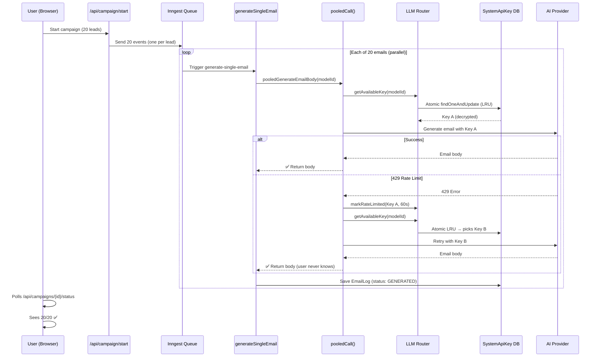

# API Key Failover Analysis — Does the Current Flow Handle It?

## The Scenario You Described

> User starts generating 20 emails. After 12 succeed, the 13th hits a rate limit. Does the system seamlessly switch to another API key and continue?

## Current Architecture (Tracing the Full Flow)



## ✅ What Already Works (No Changes Needed)

| Layer | What It Does | Status |
|---|---|---|
| **Inngest** (1 event per email) | Each email is an **independent job**. If email #13 fails, emails #14-20 keep running in parallel. No chain dependency. | ✅ Solid |
| **Inngest retries** | `retries: 5` — if a job throws, Inngest retries it with exponential backoff automatically. | ✅ Solid |
| **pooledCall()** | On 429 → marks key as rate-limited → picks next key from pool → retries. Up to 3 keys tried per call. | ✅ Solid |
| **LLM Router** | Atomic `findOneAndUpdate` with LRU sort. Two concurrent requests never pick the same key. Rate-limited keys are excluded from selection. | ✅ Solid |
| **User UX** | Frontend polls `/api/campaigns/{id}/status` for a progress count. It sees `generated: 13, 14, 15...20`. The user has zero visibility into which key was used. | ✅ Solid |
| **EmailLog** | Each email's status is tracked independently (`QUEUED → GENERATED`). No batch dependency. | ✅ Solid |

## ⚠️ One Gap Found — What Happens When ALL Keys Are Exhausted

### The Problem

If you have **2 keys** and both get rate-limited simultaneously, `pooledCall()` tries 3 times, gets 503 from the router each time, and **throws an error**. Inngest catches this and retries the job (up to 5 times with backoff).

**But:** Inngest's retry backoff might be shorter than the rate limit window (60 seconds). So the retry might also fail, burning through retries before the rate limit expires.

### Current behavior for the 20-email scenario with 2 keys:

| Email # | Key Used | What Happens |
|---|---|---|
| 1-6 | Key A | ✅ Success |
| 7-12 | Key B (Key A now LRU-rotated) | ✅ Success |
| 13 | Key A | ❌ 429 → marks A rate-limited → tries Key B |
| 13 (retry) | Key B | ❌ 429 → marks B rate-limited → **503 thrown** |
| 13 | Inngest retry #1 (after ~10s) | ❌ Both keys still rate-limited (60s window) |
| 13 | Inngest retry #2 (after ~30s) | ❌ Still rate-limited |
| 13 | Inngest retry #3 (after ~60s) | ✅ Key A's rate limit expired → Success |

**This already works** because Inngest has 5 retries with increasing backoff. By retry #3-4, the 60-second rate limit window has expired.

### But there's a subtle issue:

The `pooledCall()` throws a `Response` object (not an `Error`) when `getAvailableKey()` returns 503. Inside Inngest's `step.run()`, throwing a non-Error might not trigger Inngest's retry properly.

## Proposed Fix — Small but Important

> [!IMPORTANT]
> **Fix the 503 throw type** in `llm-router.ts`: throw an `Error` instead of a `Response` object. The `Response` throw was designed for API routes, but Inngest functions need a proper `Error` to trigger retries correctly.

### Changes needed:

**1. `lib/llm-router.ts`** — Throw an `Error` (not a `Response`) so Inngest retries work:

```diff
  if (!key) {
-   throw new Response(
-     JSON.stringify({ error: "AI service temporarily unavailable..." }),
-     { status: 503, headers: { "Content-Type": "application/json" } }
-   );
+   const err = new Error("AI service temporarily unavailable — all keys rate-limited");
+   (err as any).status = 503;
+   throw err;
  }
```

**2. `lib/ai-client.ts`** — Update `pooledCall()` to handle both `Error` and `Response` types from the router:

```diff
  } catch (error) {
+   // If the pool itself is exhausted (503), rethrow immediately
+   // so Inngest can retry after backoff
+   if (error instanceof Error && (error as any).status === 503) {
+     throw error;
+   }
    lastError = error instanceof Error ? error : new Error(String(error));
```

**3. API routes** (`generate-emails`, `generate-reply`) — Convert the Error back to a 503 Response for HTTP callers:

```diff
  } catch (error) {
-   if (error instanceof Response) return error;
+   if (error instanceof Error && (error as any).status === 503) {
+     return Response.json({ error: error.message }, { status: 503 });
+   }
```

## Summary

| Question | Answer |
|---|---|
| Does email #13 seamlessly switch to another key? | ✅ Yes — `pooledCall()` handles this automatically |
| Does the user see anything break? | ✅ No — they just see the progress counter moving |
| Can different emails use different keys? | ✅ Yes — each `step.run()` calls `getAvailableKey()` independently |
| What if ALL keys are exhausted? | ⚠️ Inngest retries handle it, but need the Error type fix above |
| Is there any "resume from where it left off" needed? | ✅ No — each email is independent, there's nothing to resume |

> [!TIP]
> **The architecture is fundamentally sound.** Each email is an independent Inngest job with its own pooled key selection. The only fix needed is the Error type change so Inngest retries work correctly when all keys are temporarily exhausted.
